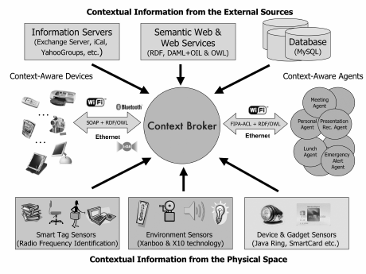
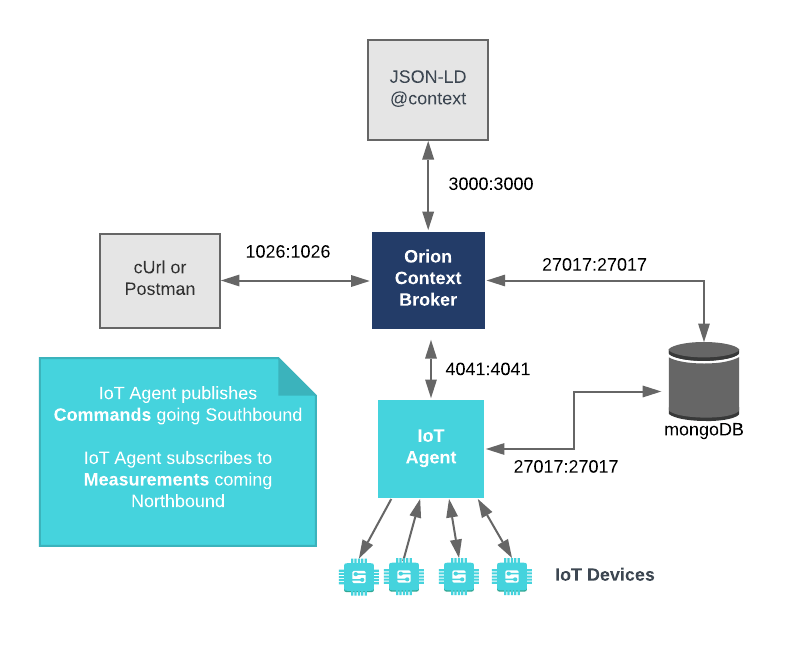

# Orion-LD

- Orion-LD is an advanced **context broker** implementation designed to **manage and distribute contextual information** in real-time.
- It is built on the principles of the **NGSI-LD (Next Generation Service Interface - Linked Data) standard**, which aims to facilitate the development of smart applications by **ensuring interoperability** and context management capabilities.
- The primary goal of Orion-LD is to enable efficient, scalable, and interoperable handling of contextual data, making it a cornerstone in the development of smart cities, IoT applications, and data-driven solutions.

## Features

- **Context Information Management**: Orion-LD allows for the creation, update, and retrieval of context information, ensuring real-time awareness and decision-making capabilities.
- **NGSI-LD Compliance**: Full adherence to the NGSI-LD standard ensures **interoperability with other compliant systems** and components, promoting a cohesive ecosystem.
- **Linked Data Integration**: Utilizes Linked Data principles to enhance **data connectivity** and **semantic relationships**, enabling *more insightful data analytics and integration*.
- **Scalability**: Designed to handle **large volumes of data** and **high-throughput** operations, making it suitable for large-scale applications.
- **Subscription and Notification**: Supports **subscription to context changes** and notifications, allowing *applications to react in real-time to changes in their environment*.
- **Federation Support**: Facilitates the federation of multiple context brokers, enabling the creation of distributed and collaborative environments.
- **Security and Privacy**: Implements robust security mechanisms to protect data integrity and privacy.

## Links

- Orion-LD GitHub Page: https://github.com/FIWARE/context.Orion-LD
- Quick-Start Guide: https://github.com/FIWARE/context.Orion-LD/blob/develop/doc/manuals-ld/quick-start-guide.md
- Official Docker Image: https://hub.docker.com/r/fiware/orion-ld
- Official FIWARE Orion Page: https://fiware-orion.readthedocs.io/en/master/


## Architecture & Function

A Context Broker acquires contextual information from heterogeneous sources and fuses into a coherent model that is then shared with computing entities in the space. 



 The Orion-LD Context Broker relies on open source MongoDB technology to keep persistence of the context data it holds.
 

## HOWTO - Orion-LD via bash

See also officiall installation-guide: https://github.com/FIWARE/context.Orion-LD/blob/develop/doc/manuals-ld/installation-guide.md

### 1. Deploy Orion-LD using Docker
```docker
  orion-ld:
    image: fiware/orion-ld
    ports:
      - "1026:1026"
    depends_on:
      - mongo-db
    command: -dbhost mongo-db

  mongo-db:
    image: mongo:4.4
    command: --nojournal
    ports:
      - "27017:27017"
```
See [docker-compose.yml](../docker-compose.yml)

### 2. Connect to Orion-LD:

Check if Orion-LD is up and running with the following command:
```shell
curl localhost:1026/ngsi-ld/ex/v1/version
```

You will receive somithing like this:
```
{
  "Orion-LD version": "post-v1.5.1",
  "based on orion": "1.15.0-next",
  "kbase version": "0.8",
  "kalloc version": "0.8",
  "khash version": "0.8",
  "kjson version": "0.8.2",
  "microhttpd version": "0.9.75-0",
  "rapidjson version": "1.0.2",
  "libcurl version": "7.61.1",
  "libuuid version": "UNKNOWN",
  "mongocpp version": "1.1.3",
  "mongoc version": "1.22.0",
  "bson version": "1.22.0",
  "mongodb server version": "4.4.28",
  "boost version": "1_66",
  "openssl version": "OpenSSL 1.1.1k  FIPS 25 Mar 2021",
  "branch": "",
  "cached subscriptions": 1,
  "Core Context": "https://uri.etsi.org/ngsi-ld/v1/ngsi-ld-core-context-v1.6.jsonld",
  "Next File Descriptor": 23
}
```

### 3. Interact with Orion-LD:

#### I. Entity without user context:
Sample based on an entity with two attributes:
- *status* (which is part of the Core Context)
- *state* (which is **not** part of the Core Context)


1. Create Entity

```shell
payload='{
  "id": "urn:entities:E1",
  "type": "T",
  "status": {
    "type": "Property",
    "value": "OK"
  },
  "state": {
    "type": "Property",
    "value": "OK"
  }
}'
curl localhost:1026/ngsi-ld/v1/entities -d "$payload" -H "Content-Type: application/json"
```
Remarks: The payload is empty, so there is no output from CURL.

Explanations of the payload:
- The entity ```"id"``` field **must** be a URI.
- The entity ```"type"``` field is **mandatory**
- Attributes must be JSON Objects, and they **must** have a ```"type"```, whose value must be any of: ```"Property"```, ```"Relationship"```, ```"GeoProperty"```.
- Attributes that are of type *Property* **must** have a ```"value"``` field
- Attributes that are of type *Relationship* **must** have an ```"object"``` field and the value of that field **must** be a URI.


2. Query this entity in the MongoDB

```shell
mongo orion

db.entities.findOne()

db.entities.find({"_id.id": "urn:entities:E1"})
```

Will return:
```json
{ 
  "_id" : { 
    "id" : "urn:entities:E1", 
    "type" : "https://uri.etsi.org/ngsi-ld/default-context/T", 
    "servicePath" : "/" 
  }, 
  "attrNames" : [ 
    "https://uri.etsi.org/ngsi-ld/status", 
    "https://uri.etsi.org/ngsi-ld/default-context/state"
  ], 
  "attrs" : { 
    "https://uri=etsi=org/ngsi-ld/status" : { 
      "type" : "Property", 
      "creDate" : 1718098748.387779, 
      "modDate" : 1718098748.387779, 
      "value" : "OK", 
      "mdNames" : [ ] 
    }, 
    "https://uri=etsi=org/ngsi-ld/default-context/state" : { 
      "type" : "Property", 
      "creDate" : 1718098748.387779, 
      "modDate" : 1718098748.387779, 
      "value" : "OK",
      "mdNames" : [ ] 
    } 
  }, 
  "creDate" : 1718098748.387779, 
  "modDate" : 1718098748.387779, 
  "lastCorrelator" : "" 
}
```

3. Query the entity on Orion-LD

```shell
# fetch a specific instance of an entity "urn:entities:E1"
curl -X GET localhost:1026/ngsi-ld/v1/entities/urn:entities:E1 -H "Accept: application/json"

# fetch all entities of a specific type "T"
curl localhost:1026/ngsi-ld/v1/entities?type=T

# fetch all entities of a specific type "T" where the expanded-URI for T is used
curl localhost:1026/ngsi-ld/v1/entities?type=https://uri.etsi.org/ngsi-ld/default-context/T

# pretty-printed outut
curl 'localhost:1026/ngsi-ld/v1/entities?type=T&prettyPrint=yes&spaces=2'

# also show the context-URI in the payload
curl 'localhost:1026/ngsi-ld/v1/entities?type=T&prettyPrint=yes&spaces=2' -H "Accept: application/ld+json"
```

This will return (without context):
```json
{
  "id":"urn:entities:E1",
  "type":"T",
  "status":{
    "type":"Property",
    "value":"OK"
  },
  "state":{
    "type":"Property",
    "value":"OK"
  }
}
```

#### II. Entity with user-defined context

Sample based on an entity with three attributes:
- status (expanded according to the *core context*)
- state (expanded according to the *user context*)
- state2 (expanded according to the *default URL*)

1. Create Entity

```shell
payload='{
  "@context": {
    "status": "http://a.b.c/attrs/status",
    "state":  "http://a.b.c/attrs/state"
  },
  "id": "urn:entities:E2",
  "type": "T",
  "status": {
    "type": "Property",
    "value": "From Core Context"
  },
  "state": {
    "type": "Property",
    "value": "From User Context"
  },
  "state2": {
    "type": "Property",
    "value": "From Default URL"
  }
}'
curl localhost:1026/ngsi-ld/v1/entities -d "$payload" -H "Content-Type: application/ld+json"
```

2. Query the entity in MongoDb

```shell
mongo orion

db.entities.findOne({"_id.id": "urn:entities:E2"})
```

This will return:
```json
{
        "_id" : {
                "id" : "urn:entities:E2",
                "type" : "https://uri.etsi.org/ngsi-ld/default-context/T",
                "servicePath" : "/"
        },
        "attrNames" : [
                "https://uri.etsi.org/ngsi-ld/status",
                "http://a.b.c/attrs/state",
                "https://uri.etsi.org/ngsi-ld/default-context/state2"
        ],
        "attrs" : {
                "https://uri=etsi=org/ngsi-ld/status" : {
                        "type" : "Property",
                        "creDate" : 1718113679.5576315,
                        "modDate" : 1718113679.5576315,
                        "value" : "From Core Context",
                        "mdNames" : [ ]
                },
                "http://a=b=c/attrs/state" : {
                        "type" : "Property",
                        "creDate" : 1718113679.5576315,
                        "modDate" : 1718113679.5576315,
                        "value" : "From User Context",
                        "mdNames" : [ ]
                },
                "https://uri=etsi=org/ngsi-ld/default-context/state2" : {
                        "type" : "Property",
                        "creDate" : 1718113679.5576315,
                        "modDate" : 1718113679.5576315,
                        "value" : "From Default URL",
                        "mdNames" : [ ]
                }
        },
        "creDate" : 1718113679.5576315,
        "modDate" : 1718113679.5576315,
        "lastCorrelator" : ""
}
```

3. Query the entity on Orion-LD

```shell
curl -X GET localhost:1026/ngsi-ld/v1/entities/urn:entities:E2 -H "Accept: application/json"

# Pretty-Printed, and return the context in the payload
curl -X GET 'localhost:1026/ngsi-ld/v1/entities/urn:entities:E2?prettyPrint=yes' -H "Accept: application/ld+json"
```

This will result to
```json
{
  "@context": "https://uri.etsi.org/ngsi-ld/v1/ngsi-ld-core-context-v1.6.jsonld",
  "id":"urn:entities:E2",
  "type":"T",
  "status":{
    "type":"Property",
    "value":"From Core Context"
  },
  "http://a.b.c/attrs/state":{
    "type":"Property",
    "value":"From User Context"
  },
  "state2":{
    "type":"Property",
    "value":"From Default URL"
  }
}
```

**ATTENTION: Each request uses the current context - the context used when issuing the request. Never mind what context was used before.**

Advanced filtering:
- ?type=
- ?attrs=<A1,A2,...An>
- ?id=<ID1, ID2, ... IDn>
- ?q=

Pagination:
- &offset=
- &limit=

Query-Language (?q=...):
- an attribute called X: ```?q=X```
- no attribute called X: ```?q=!X```
- an attribute X that is equal to 50: ```?q=X==50```
- an attribute X that is equal to some of the values in a list: ```?q=X==50,60,70,114```
- an attribute X that has a value inside a range: ```?q=X==50..74```

Examples:
```shell
# show entities of specific type
curl localhost:1026/ngsi-ld/v1/entities?type=SensorReading

# show entities with attributes: "temperature" and/or "humidity"
curl localhost:1026/ngsi-ld/v1/entities?attrs=temperature,humidity

# ... won't return anything
curl localhost:1026/ngsi-ld/v1/entities?attrs=invalid

# show entity with a specific id
curl localhost:1026/ngsi-ld/v1/entities?id=A0:DD:6C:10:8A:4C
```

TODO:
* not covered in this document: retrieving with context (in HTTP headers), see https://github.com/FIWARE/context.Orion-LD/blob/develop/doc/manuals-ld/quick-start-guide.md#entity-retrieval-example-2---with-context


## HOWTO - Orion-LD via Python

Integrating Orion-LD into a Python application.

### 1. Deploy Orion-LD using Docker

like above, see [docker-compose.yml](../docker-compose.yml)

### 2. Install required Libraries with pip
```shell
pip install requests fiware-orion
```

### 3. Connect and Interact with Orion-LD:

```python
import requests

ORION_LD_URL = "http://localhost:1026/ngsi-ld/v1/entities"

# Create a new entity
entity = {
    "id": "urn:ngsi-ld:Device:001",
    "type": "Device",
    "temperature": {"type": "Property", "value": 23.5}
}

response = requests.post(ORION_LD_URL, json=entity, headers={"Content-Type": "application/json"})
print(response.status_code, response.json())
```

### 4. Handle Notifications, e.g. using a Flask webserver who will receive the requests from Orion-LD
```python
import json
from flask import Flask, request

app = Flask(__name__)

@app.route('/notify', methods=['POST'])
def notify():
    notification = request.json
    print("Received notification:", json.dumps(notification, indent=2))
    return '', 204

if __name__ == '__main__':
    app.run(port=5000)
```