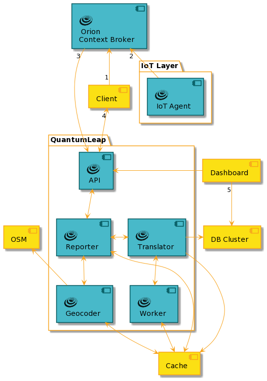

# QuantumLeap

- **Open-Source** Tool for **Real-time Data Processing** and Context Management in IoT Applications.
- Developed as part of the FIWARE initiative, QuantumLeap serves as **a bridge between IoT devices and big data infrastructures**, enabling efficient and scalable **data management**.
- Its primary objective is to enable developers to **collect, store, query, and analyze real-time data streams** from diverse IoT devices.

## Features

- **Real-time Data Ingestion**: QuantumLeap can ingest high-velocity data streams from various IoT devices, ensuring minimal latency and real-time availability of data.
- **Context Management**: It **integrates seamlessly with the FIWARE Context Broker**, allowing for the management of context information in a structured and standardized manner.
- **Data Storage and Querying**: QuantumLeap supports various backends, including CrateDB and TimescaleDB, for efficient storage and querying of time-series data.
- **Scalability**: Built to handle large volumes of data, QuantumLeap can scale horizontally to accommodate growing IoT deployments.
- **APIs and Integration**: Provides RESTful APIs for data ingestion, querying, and management, facilitating easy integration with other applications and services.
- **Data Visualization**: Compatible with popular visualization tools like Grafana, enabling developers to create insightful dashboards and reports.
- **Open-Source and Extensible**: As an open-source project, QuantumLeap offers extensibility and customization, allowing developers to tailor it to specific use cases and requirements.

## Links

- Official FIWARE QuantumLeap Site: https://quantumleap.readthedocs.io/en/latest/
- NGSI-LD QuantumLeap Tutorial: https://documenter.getpostman.com/view/513743/TWDUpxxx

## Architecture & Function

### A sample application architecture using QuantumLeap

FIWARE QuantumLeap is a generic enabler which is used to persist context data into a CrateDB database. IoT sensors are connected and persists measurements into the database. To retrieve time-based aggregations of such data, users can either use QuantumLeap query API or connect directly to the CrateDB HTTP endpoint. Results are visualised on a graph or via the Grafana time series analytics tool.


### QuantumLeap's internal components

QuantumLeap's Reporter component parses and validates POSTed data. Additionally, if geo-coding is configured, the Reporter invokes the Geocoder component to harmonise the location representation of the notified entities, which involves looking up geographic information in OpenStreetMap (OSM). At this stage, depending on the deployed mode you selected, data are immediately processed or stored in the cache for later processing. In the first case, the Reporter passes on the validated and harmonised NGSI entities to a Translator component. In the second case, the Reporter stores on the validated and harmonised NGSI entities to the Cache component, that is acting as a message queue. The Worker component will read pending messages to be processed and will pass them to a Translator component. The Admin Guide contains more details about the work queue.



## HOWTO

To integrate QuantumLeap into a Python application:

1. Deploy QuantumLeap using Docker
```docker
  quantumleap:
    image: orchestracities/quantumleap:0.8.0
    ports:
      - "8668:8668"
    depends_on:
      - crate-db
    environment:
      - CRATE_HOST=crate-db     ## The host serving the Crate-DB!

  crate-db:
    image: crate:latest
    ports:
      - "4200:4200"
      - "4300:4300"
```
See [docker-compose.yml](../docker-compose.yml)

2. Subscribe to Context Changes:
Use the FIWARE Context Broker to subscribe to context changes and forward them to QuantumLeap for real-time processing.
```python
def create_subscription():
    headers = {
        "Content-Type": "application/ld+json",
    }
    subscription = {
        "id": "urn:ngsi-ld:Subscription:1",
        "description": "Notify QuantumLeap",
        "type": "Subscription",
        "entities": [
            {
                "type": "SensorReading"
            }
        ],
        "watchedAttributes": ["temperature"],
        "notification": {
            "attributes": ["temperature", "humidity", "pressure"],
            "endpoint": {
                "uri": "http://quantumleap:8668/v2/notify",
                "accept": "application/json",
            }
        },
        "@context": NGSI_LD_CONTEXT,        
    }

    response = requests.post("http://localhost:1026/ngsi-ld/v1/subscriptions", headers=headers, json=subscription)
    if response.status_code == 201:
        print("Subscription created successfully.")
    else:
        print("Failed to create subscription:", response.status_code, response.text)
```
see [functions.py](../src/functions.py)

3. Data Ingestion:
Configure the Context Broker to send data to QuantumLeap using the appropriate API endpoints.

A sample to do that manually in Python:
```python
import requests
# Ingest data
payload = {
    "entityId": "sensor1",
    "entityType": "TemperatureSensor",
    "temperature": {"value": 23.5, "type": "Number"}
}
response = requests.post('http://localhost:8668/v2/entities/sensor1/attrs', json=payload)
```

4. Data Querying (and Visualization):
Use QuantumLeap’s RESTful API to query stored time-series data.  
The endpoint typically follows the format ```http://<quantumleap_host>:8668/v2/entities/<entity_id>/attrs/<attribute_name>```  
```python
import requests
# Query data
response = requests.get('http://localhost:8668/v2/entities/sensor1/attrs/temperature')
print(response.json())
```

or integrate QuantumLeap with Grafana by setting up a data source in Grafana to query data from QuantumLeap’s backend.

## Orion-LD vs. QuantumLeap

| Orion-LD | QuantumLeap |
|----------|-------------|
| managing and providing real-time **context information** using the NGSI-LD standard | processing, storing, and querying time-series **data derived from context information** |
| **real-time** updates and queries for **current state** data | **historical data**, storing context updates as time-series entries for later analysis |
| NGSI-LD standard | time-series databases |
| Acts as a **central context data manager** in IoT ecosystems | **Extends the functionality of context brokers** by adding time-series data management and analysis features |
